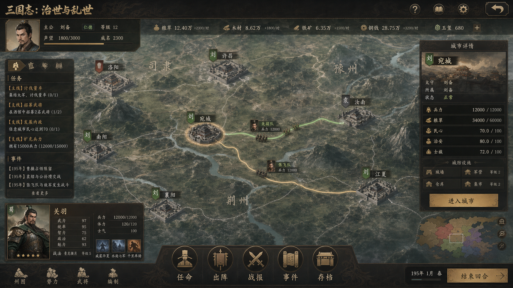

# 正式 UI 风格方向

## 当前结论

Content Alpha 已确认第一版正式 UI 风格方向。该方向用于后续正式界面实装的视觉基准，不代表 Beta 正式 UI 已完成。

参考图：

## 风格关键词

- 历史战略感：整体气质严肃、克制，不走轻量休闲或夸张幻想风。
- 信息密度高：主界面应服务长期扫描、比较和重复操作，避免营销页式大留白。
- 暗漆木与旧纸质感：面板可使用深色漆木、旧纸底和细边框建立三国题材氛围。
- 金红点缀：重要状态、势力、警告和可操作入口可使用克制金色或深红色强调。
- 6px 左右小圆角：工具、面板和卡片保持稳重，不使用过度圆润的轻娱乐风格。
- 图文并重：半身像、城市状态、部队路线和事件反馈要同时服务识别和决策。

## 信息架构落地原则

- 战略大地图应保留为第一视口核心，城市、路线、部队和势力归属必须来自真实运行状态。
- 右侧面板优先承载城市、武将、势力和当前选择详情，不再长期依赖调试文本堆叠。
- 底部命令栏可承载任命、出阵、战报、事件、存档等高频入口。
- 半身像卡片只能读取已审计的项目内 `res://` 资源，不允许用默认图掩盖缺图。
- 所有规划中的界面仍必须标记为 `planned`，不得因为有风格图就当作已实现玩法。
- 线框规格已进入 `data/content_alpha/ui_wireframe_spec.json`，后续正式 UI 实装必须先满足线框中的布局区域、组件、状态绑定和交互合同。
- 主题 Token 已进入 `data/content_alpha/ui_theme_tokens.json`，后续正式 UI 控件必须优先使用其中的色板、字号、间距、圆角、控件状态和响应式规则。
- 基础 Godot Theme 已进入 `themes/content_alpha_formal_theme.tres`，后续控件不得绕过 Token/Theme 链路散写正式样式。
- 正式主界面 HUD 外壳已进入 `scenes/formal_hud.tscn`，城市详情面板已进入 `scenes/city_detail_panel.tscn`，任命与出阵面板已进入 `scenes/appointment_sortie_panel.tscn`，战报面板已进入 `scenes/battle_report_panel.tscn`，事件日志面板已进入 `scenes/event_log_panel.tscn`，存档读档面板已进入 `scenes/save_load_panel.tscn`；后续正式界面应沿该外壳继续拆分，而不是继续堆叠调试文本。
- Formal HUD 已按风格图重排为顶部信息带、左侧任务事件、右侧城市详情、左下武将卡和底部命令台；后续补功能应优先填充这些既定区域，而不是再新增漂浮调试框。
- 右侧城市详情已按正式信息栏拆成兵粮民生、治理状态、太守、属官和动作区；不存在真实上限字段的数据不得显示成伪造的“当前 / 上限”。
- 左下角领袖卡文本已接入真实 `forces / officers` 运行时状态；半身像在正式武将头像绑定完成前只能标注为候选资源示例，不得把测试武将伪装成源项目历史人物。
- 右侧当前选择摘要应展示真实名称和玩家可读状态；内部 ID 只用于测试、日志和错误定位，不作为正式摘要的常态显示内容。
- 战略地图常态标签应展示城市名、真实势力名、主将名和兵力等可读信息；`ARMY_* / FORCE_* / OFF_*` 等内部 ID 只允许出现在测试、日志和错误信息中。

## 仍未完成

- 授权中文 UI 字体尚未实现。
- 正式武将名册仍处于规格规划阶段；任命与出阵当前已接通真实系统，但仍缺正式武将选择器、路线预览、目标确认和结果反馈强化；战报和事件日志当前已接通真实运行时日志，但仍缺完整历史事件链和对象跳转协议；存档读档当前已接通真实 `SaveSystem`，但仍缺多槽 UI、版本迁移策略和主菜单入口。
